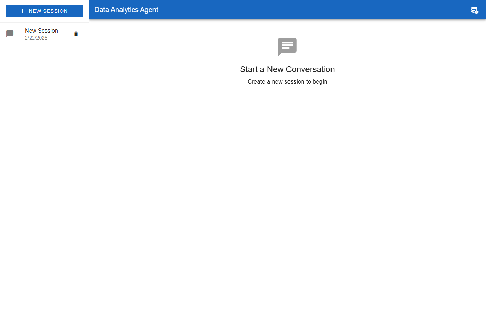
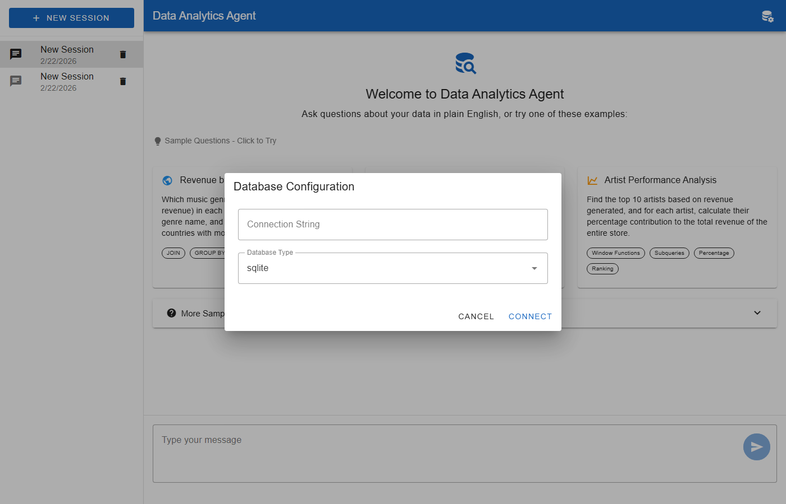
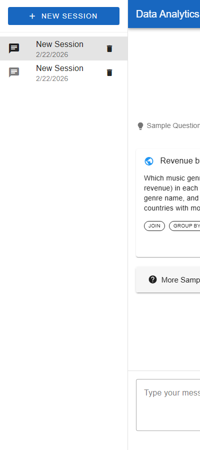

# Data Analytics Agent

A General Purpose Data Analytics Agent that provides intelligent question answering with SQL database access capabilities. The agent explains its approach, shows tool usage details, and provides SQL query explanations in plain language.

## Screenshots

### Main Interface

*Clean, modern interface with session management and real-time streaming responses*

### Database Connection

*Easy database configuration with support for SQLite (PostgreSQL/MySQL coming soon)*

### Session Management

*Persistent conversation history with easy session switching*

## Features

- **Intelligent SQL Query Generation**: Automatically generates SQL queries based on natural language questions
- **Transparent Processing**: Shows approach explanation and tool usage details
- **SQL Explanations**: Provides plain language explanations of executed SQL queries
- **Session Management**: Persistent conversation history with SQLite storage
- **Real-time Streaming**: Server-Sent Events for streaming responses
- **Web-based Interface**: Clean, modern UI built with Vue.js and Vuetify

## Architecture

### Backend
- **FastAPI**: Modern Python web framework for building APIs
- **UV**: Fast Python package manager
- **SQLite**: Session storage and sample database
- **Claude 4.5**: LLM for intelligent query processing

### Frontend
- **Vue.js 3**: Progressive JavaScript framework
- **Vuetify 3**: Material Design component library
- **Marked.js**: Markdown rendering
- **Prism.js**: Code syntax highlighting

## Installation

### Prerequisites
- Python 3.9 or higher
- UV package manager (install with `pip install uv`)

### Setup

1. Clone the repository:
```bash
cd agent2
```

2. Install backend dependencies:
```bash
cd backend
uv pip sync
```

3. Set up environment variables:
```bash
cp .env.example .env
# Edit .env with your configuration
```

## Running the Application

### Windows
```bash
start.bat
```

### Linux/Mac
```bash
cd backend
uv run uvicorn app.main:app --reload --host 0.0.0.0 --port 8080
```

The application will be available at `http://localhost:8080`

## Usage

### 1. Start a New Session
Click "New Session" in the left sidebar to begin a conversation.

### 2. Connect to a Database
Click the database icon in the top bar and configure your database connection:
- **SQLite**: Enter the path to your `.db` file
  - **Chinook Music Store**: `../data/chinook.db` (Recommended for demos)
- **PostgreSQL/MySQL**: Coming soon

See [CHINOOK_GUIDE.md](CHINOOK_GUIDE.md) for detailed examples using the Chinook database.

### 3. Ask Questions
Type natural language questions about your data:
- "Show me the top 5 customers by revenue"
- "What's the average order value by month?"
- "Which products are low in stock?"
- "List all orders from the last 30 days"

### 4. View Results
The agent will:
- Execute appropriate SQL queries
- Display the results in a formatted table
- Show the approach taken
- Explain the SQL query in plain language
- Display tool usage details (collapsible)

## Configuration

Copy `backend/.env.example` to `backend/.env` and configure:

```env
LLM_BASE_URL=your_llm_endpoint_here
LLM_API_KEY=your_api_key_here
LLM_MODEL=claude4.5
DATABASE_PATH=../data/sessions.db
LOG_LEVEL=INFO
CORS_ORIGINS=*
HOST=0.0.0.0
PORT=8000
```

See [backend/ENV_CONFIG.md](backend/ENV_CONFIG.md) for detailed configuration instructions.

## Project Structure

```
agent2/
├── backend/
│   ├── app/
│   │   ├── main.py              # FastAPI entry point
│   │   ├── config.py            # Configuration settings
│   │   ├── models/              # Pydantic models
│   │   ├── services/            # Business logic
│   │   │   ├── agent.py         # Main agent logic
│   │   │   ├── llm_client.py    # LLM integration
│   │   │   ├── session_manager.py # Session persistence
│   │   │   └── sql_tool.py      # SQL execution
│   │   ├── api/                 # API endpoints
│   │   └── utils/               # Utilities
│   ├── pyproject.toml           # UV configuration
│   ├── .env                     # Environment variables (create from .env.example)
│   ├── .env.example             # Environment template
│   └── ENV_CONFIG.md            # Environment configuration guide
├── frontend/
│   └── index.html               # Vue.js SPA
├── data/
│   ├── sessions.db              # Session storage
│   └── chinook.db               # Chinook music store database
└── start.bat                    # Windows startup script
```

## API Endpoints

### Session Management
- `POST /api/sessions` - Create new session
- `GET /api/sessions` - List all sessions
- `GET /api/sessions/{id}` - Get session with messages
- `DELETE /api/sessions/{id}` - Delete session

### Messaging
- `POST /api/sessions/{id}/messages` - Send message (SSE response)
- `GET /api/sessions/{id}/stream` - SSE stream for session

### Database
- `POST /api/database/connect` - Configure database connection
- `GET /api/database/schema` - Get database schema

## Chinook Database

The included Chinook database is a sample music store database with:

### Key Tables
- **Customer** - Customer information and location
- **Invoice** - Sales transactions
- **InvoiceLine** - Individual items in each sale
- **Track** - Songs available for purchase
- **Album** - Music albums
- **Artist** - Recording artists
- **Genre** - Music genres
- **Employee** - Store employees

### Sample Queries
- "Show me total revenue by country"
- "What are the top selling genres?"
- "List the best customers by total purchases"
- "Show sales trends over time"

See [CHINOOK_GUIDE.md](CHINOOK_GUIDE.md) for detailed examples and queries.

## Security Considerations

- SQL injection prevention via query validation
- Read-only database access by default
- Input sanitization for XSS prevention
- Secure credential storage in environment variables

## Troubleshooting

### Database Connection Issues
- Ensure the database file path is correct
- For SQLite, use absolute or relative paths from the backend directory
- Check file permissions

### LLM Connection Issues
- Verify the LLM endpoint is accessible
- Check API key validity
- Review logs in the console for detailed error messages

### Session Storage Issues
- Ensure `data/` directory exists and is writable
- Check SQLite database integrity
- Clear sessions.db if corrupted and restart

## Future Enhancements

- Additional database support (PostgreSQL, MySQL)
- CSV file upload and analysis
- Data visualization with charts
- Query result caching
- Export conversation history
- Multi-database connections
- Advanced query optimization

## License

MIT License

## Support

For issues or questions, please create an issue in the repository.